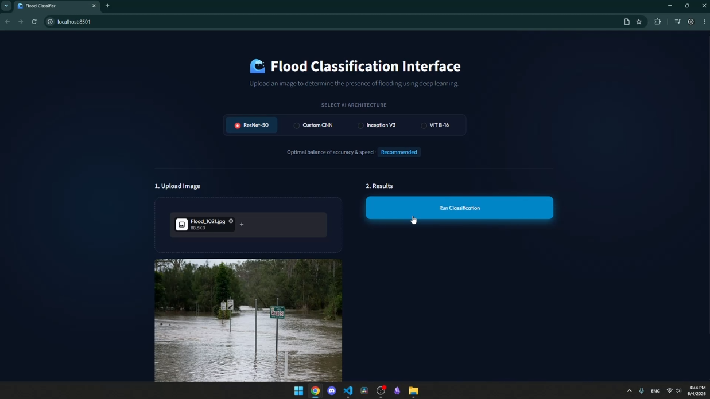
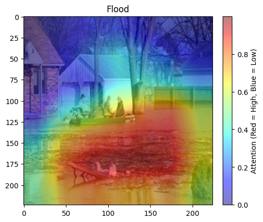
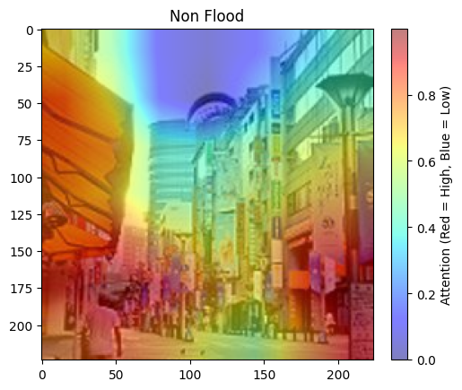

# Flood Detection with Interface and XAI

A deep learning flood image classification project with a **Streamlit interface**, **FastAPI backend**, multiple CNN/Transformer models, and **Grad-CAM explainability**.

The system classifies uploaded images as **Flood** or **Not Flood**, returns prediction confidence and inference time, and visualizes model attention using XAI heatmaps.

---

## Demo

### Interface Preview



### Interface Showcase Video

[Watch the interface demo](interface_showcase.gif)

---

## Grad-CAM Explainability

Grad-CAM was used to visualize which regions of the image influenced the model's prediction.

| Flood Image Grad-CAM | Non-Flood Image Grad-CAM |
|---|---|
|  |  |

---

## Project Summary

| Item | Description |
|---|---|
| Task | Binary image classification |
| Classes | Flood / Not Flood |
| Interface | Streamlit |
| Backend | FastAPI |
| Explainability | Grad-CAM |
| Models | ResNet-50, Inception V3, ViT-B/16, Custom CNN |

---

## Models Compared

The project compares multiple deep learning architectures for flood detection:

- **ResNet-50**
- **Inception V3**
- **Vision Transformer ViT-B/16**
- **Custom CNN**

ResNet-50 achieved the best overall balance between classification performance and inference speed, while the Custom CNN was the fastest model.

---

## System Architecture

```text
User Image
   ↓
Streamlit Interface
   ↓
FastAPI Backend
   ↓
Selected Deep Learning Model
   ↓
Prediction + Confidence + Inference Time
   ↓
Grad-CAM Explainability
````

---

## Features

* Upload an image through a clean web interface
* Select between multiple trained architectures
* Classify images as Flood or Not Flood
* Display prediction confidence
* Measure inference time
* Use Grad-CAM to explain model decisions
* Compare CNN-based and Transformer-based approaches
* Run through a FastAPI backend and Streamlit frontend

---

## Installation

Clone the repository:

```bash
git clone https://github.com/abstract-inf/Flood-Detection-with-interface-and-XAI.git
cd Flood-Detection-with-interface-and-XAI
```

Install dependencies:

```bash
pip install -r requirements.txt
```

---

## Running the Project

You need two terminals.

### Terminal 1: Run FastAPI Backend

```bash
uvicorn api:app --reload --port 8000
```

### Terminal 2: Run Streamlit Interface

```bash
streamlit run app.py
```

Then open the Streamlit URL shown in the terminal.

---

## Repository Structure

```text
Flood-Detection-with-interface-and-XAI/
│
├── api.py                         # FastAPI backend
├── app.py                         # Streamlit frontend
├── requirements.txt               # Project dependencies
├── flood_detection_XAI_final.ipynb # Training, evaluation, and XAI notebook
│
├── interface.png                  # Interface screenshot
├── interface_showcase.mp4         # Demo video
├── flood_GradCam.png              # Grad-CAM for flood image
├── non_flood_GradCam.png          # Grad-CAM for non-flood image
│
└── saved_models/                  # Trained model weights
```

---

## Explainability

The project uses **Grad-CAM** to make the model's decision more interpretable.
Instead of only showing the final prediction, Grad-CAM highlights the image regions that contributed most to the classification result.

This is important because flood detection models should not only be accurate, but also understandable, especially in environmental monitoring and disaster-response applications.

---

## Tech Stack

* Python
* PyTorch
* FastAPI
* Streamlit
* Torchvision
* Grad-CAM
* OpenCV
* PIL

